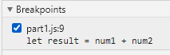
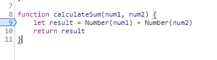

# DevTools - Debugging

---

1. Breakpoints
   
2. Watch expression
 
4. The values being added were treated as strings instead of numbers, so the + concatenated the two variables instead of adding them numerically. 
5. I would fix this bug by converting the type of `num1` and `num2` to numbers using `Number()` within `calculateSum`
6. The fix 

# DevTools - Network Tab

---

1. citylogs.json
2. part2.js:2
3. 11.7mb
4. 5.15 seconds

5. Mozilla/5.0 (Windows NT 10.0; Win64; x64) AppleWebKit/537.36 (KHTML, like Gecko) Chrome/88.0.4324.104 Safari/537.36 
6. Apache
7. Tue, 26 Jan 2021 22:14:13 GMT
8. application/json
9. fetchData